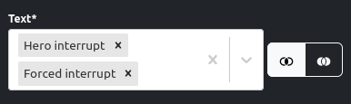
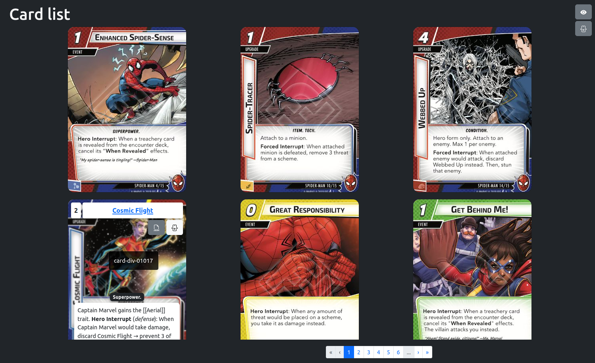

# MarvelCDB filtering

Web application to visualize cards from MarvelCDB with filtering options.

Thanks to [MarvelCDB](https://marvelcdb.com/) for the work and excelent application.

If you want to support the project, I would recommend **their** [Patreon](https://www.patreon.com/kamalisk). In my case it does not entail any more cost than the hours dedicated to this project.

Applicación web para visualizar cartas desde MarvelCDB con opciones de filtrado.

Gracias a [MarvelCDB](https://es.marvelcdb.com/) por el trabajo y excelente aplicación.

Si deseas apoyar el proyecto, recomendaría **su** [Patreon](https://www.patreon.com/kamalisk). En mi caso no conlleva mas coste que las horas dedicadas a este proyecto.

## Reducing the load of MarvelCDB

I wouldn't like marvelcdb to saturate due to this app, so this are the 
main things done to reduce the amount of calls to MarvelCDB:

* Cards are downloaded to the browser (using local storage).
* Warnings when cards are removed and when all pack cards are loaded.
* Images are paginated.
* Images are lazy loaded, so they are downloaded just when they are visible.
* Filtering is done against local list of cards.

> Pack list is always downloaded just in case there was an update.

## How does it work?

### First time

The first time you enter the app, you have to click on *Download manager*. There:

1. Choose the *language*.
1. Click on *Download all* or pick the packs you own/want to download.

Now, you will have the list of cards on your browser. If you click on *Card list*, you should see the list of cards.

### Examples

#### 1. Forced and hero interrupts

We want to list all cards that contain *Hero interrupt* or *Forced interrupt* on its text.

So we have to add those concepts in the text input and choose the left option (*At least one must match*).

That way, you will get all cards with *Hero interrupt* text on them and all cards wth *Forced interrupt* on them.

